<link rel='stylesheet' href='web/swiss.css'/>

version: 10-11-2020 17:30

# Lab session: Eclipse Modeling Framework

## Tutorial

### Domain model

A data model, sometimes also called domain model, represents the data you want to work with. For example, if you develop an online flight booking application, you might model your domain model with objects like Person, Flight, Booking etc. The EMF tooling allows you to create UML diagrams.

A good practice is to model the data model of an application independently of the application logic or user interface. This approach leads to classes with almost no logic and a lot of properties, e.g., a Person class could have the firstName, lastName, Address properties, etc.

With EMF you define your domain model explicitly. This helps to provide clear visibility of the model. The code generator for EMF models can be adjusted and in its default setting. It provides change notification functionality to the model in case of model changes. EMF generates interfaces and a factory to create your objects; therefore, it helps you to keep your application clean from the individual implementation classes.

Another advantage is that you can regenerate the Java code from the model at any point in time.

### Eclipse Modeling Framework (EMF)

The Eclipse Modeling Framework (EMF) is a set of Eclipse plug-ins which can be used to model a data model and to generated code or other output based on this mode. EMF has a distinction between the meta-model and the actual model. The meta-model describes the structure of the model. A model is a concrete instance of this meta-model.

EMF allows the developer to create the meta-model via different means, e.g., XMI, Java annotations, UML or an XML scheme. It also allows to persists the model data; the default implementation uses a data format called XML Metadata Interchange.

### Ecore

The ecore file allows to define the following elements.

* `EClass`: represents a class, with zero or more attributes and zero or more references.
* `EAttribute`: represents an attribute which has a name and a type.
* `EReference`: represents one end of an association between two classes. It has flags to indicate if it represents a containment and a reference class to which it points.
* `EDataType`: represents the type of an attribute, e.g., `int`, `float` or `java.util.Date`

The Ecore model shows a root object representing the whole model. This model has children which represent the packages, whose children represent the classes, while the children of the classes represent the attributes of these classes.

You can create a graphical representation of an existing ecore model via the context menu of an `.ecore` file and by selecting `Initialize Ecore Diagram...`.

## Exercise

Define a new EMF model 

### Project and initial model creation

Create a new project called com.vogella.emf.webpage.model via File  New  Project…​  Ecore Modeling Project.

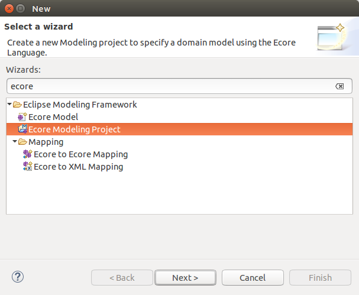

Enter webpage.ecore as the Domain File Name parameter.

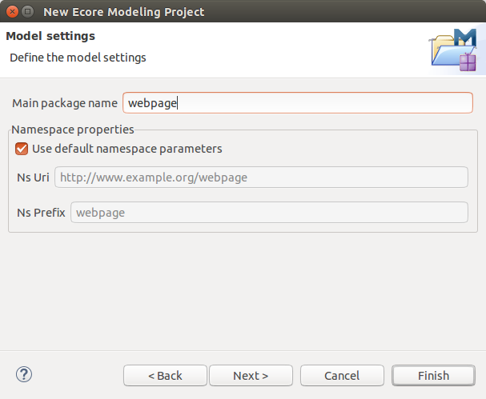

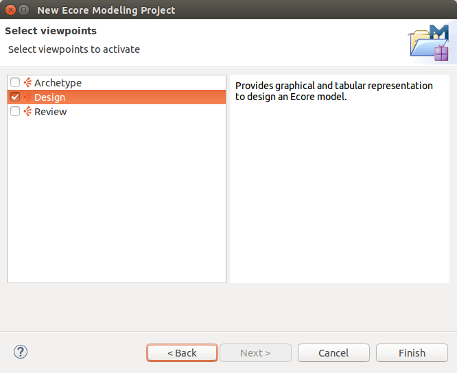

This should open a visual editor for creating EMF models.

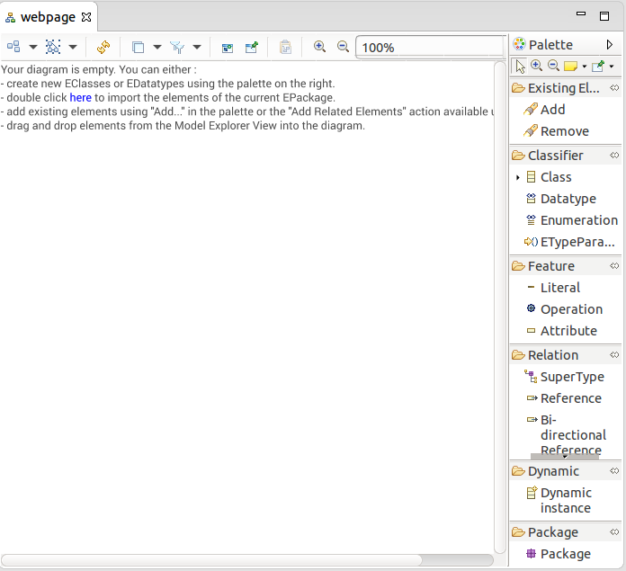

Open the Properties view via the menu Window  Show View  Other…​  Properties. This view allows you to modify the attributes of your model elements.

Click on Class and click into the editor to create a new class. Create the MyWeb, Webpage, Category and Article EClasses.

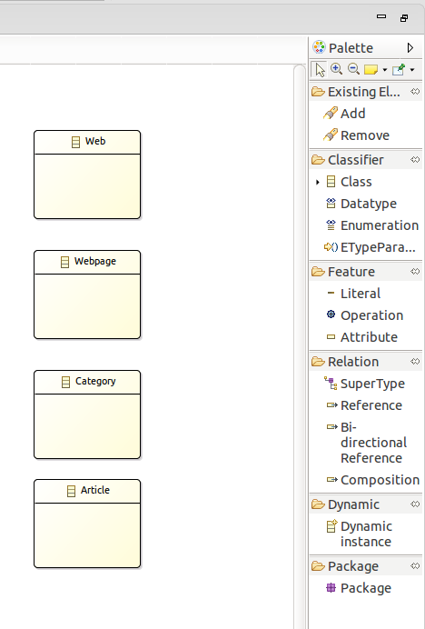

Use the Attribute node to assign the attribute called name to each object. This attribute should have the EString type.

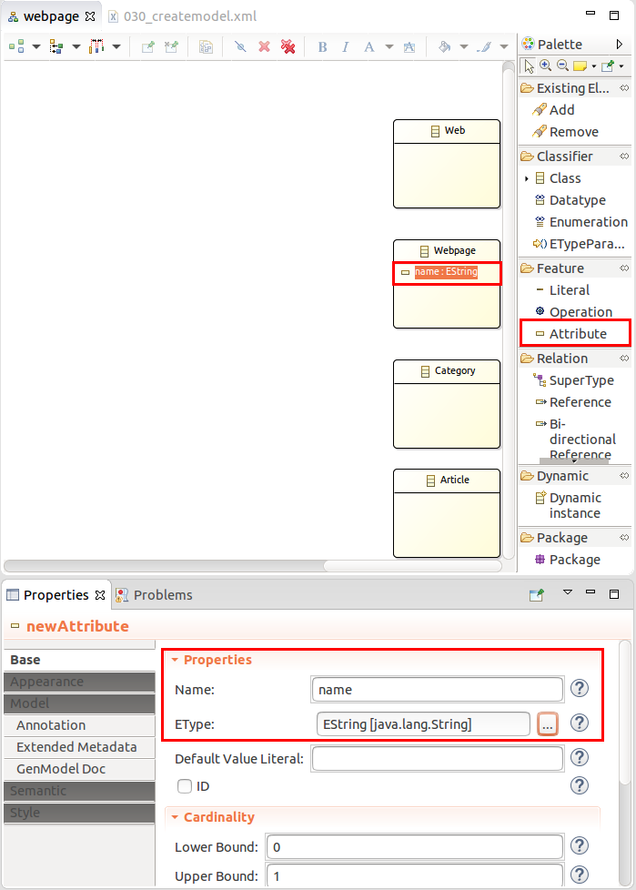

Add the title, description, and keywords attributes to the Web and Webpage model elements.

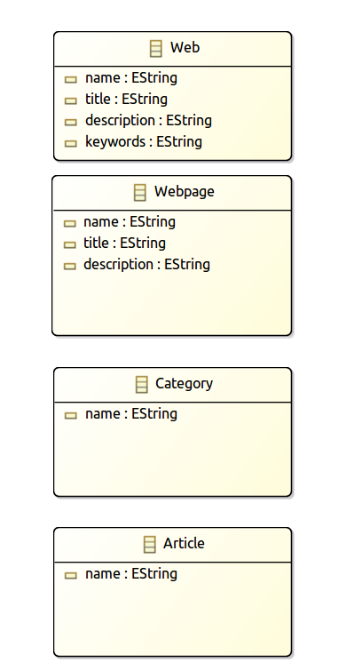

We want to use the data type calendar in our model. Select Datatype and drag it into your model. Assign the name Calendar to it. Use java.util.Calendar as type parameter.

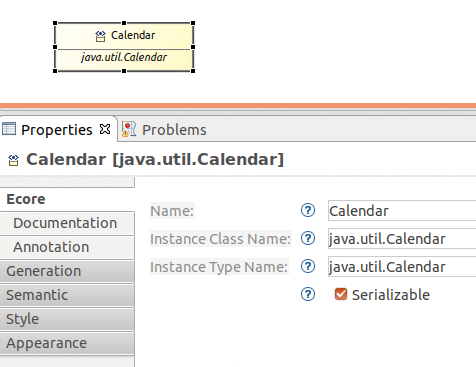

Add a new Attribute called created to Article and use the new type Calendar.

Select References and create an arrow similar to the following picture. Make sure the upper bound is set to * and that the Containment property is flagged.

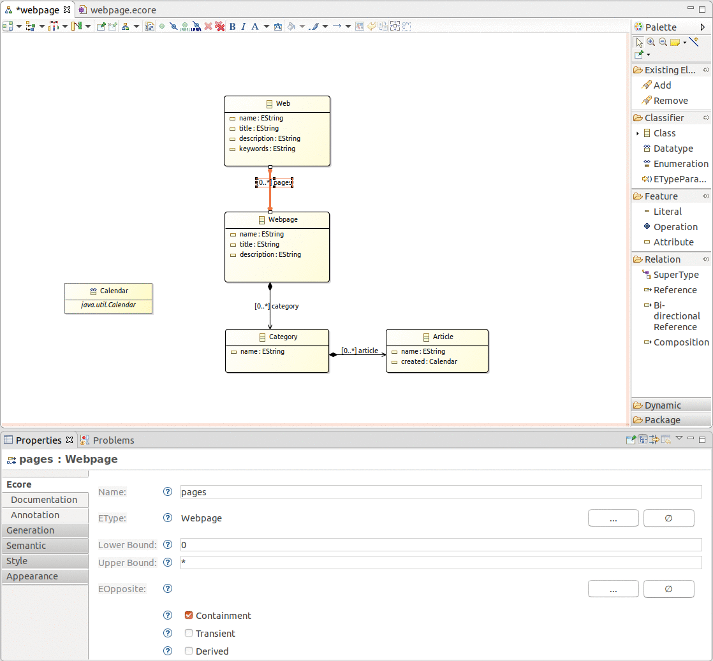

Close the diagram and open the webpage.ecore file. The result should look like the following screenshot.

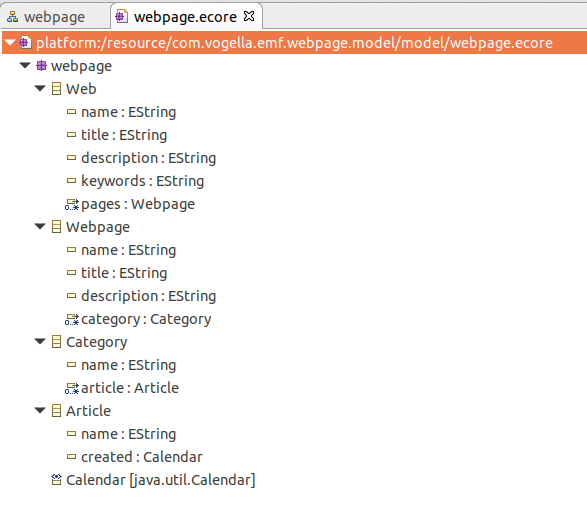

### Create the metamodel instance

In the sample Ecore model editor, right click on the root class and select `Create dynamic instance`.

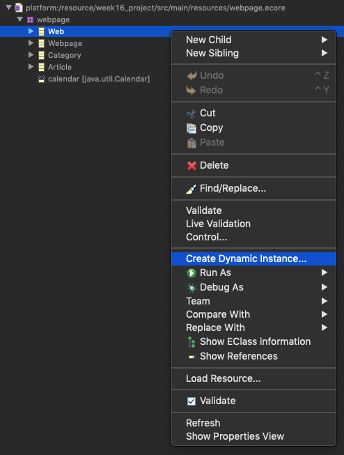

Save the file with name `webpage.xmi` and open it with the sample **reflective** Ecore model editor. 

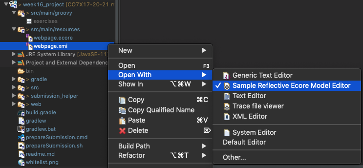

You should now see an editor for your webpage.xmi. 

Right-click on Web and create a new element. To edit the elements use the Properties View which can be found under Window  Show View  Properties.

Set the name of the website as shown in the figure.

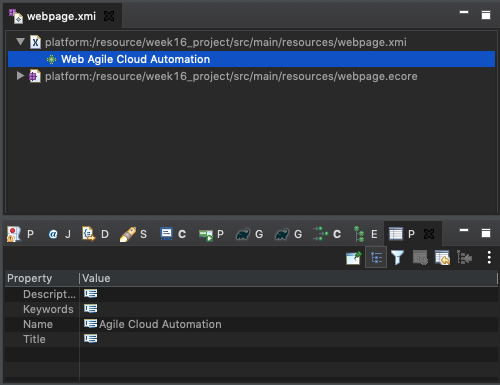

Create a webpage by creating a new child. Containment references can be created by creating child instances as shown in the figure. 

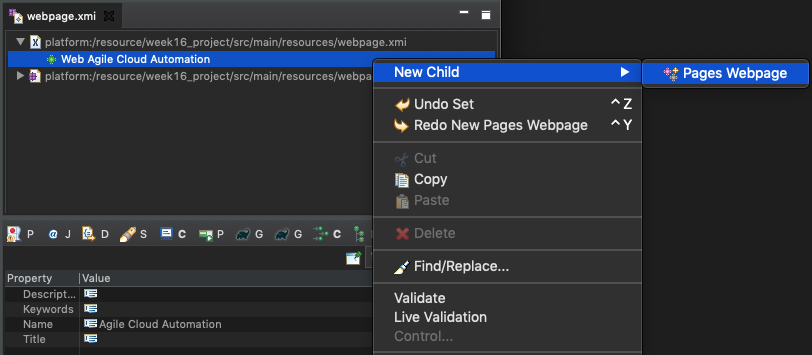

Set the name of the web page as shown in the figure.

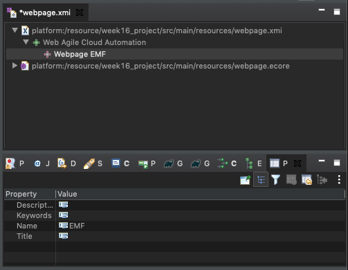

In the same way, create a containment reference to a new category. **The name of this category must be your username**, as shown below.

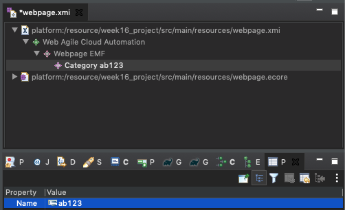

Save your created model.

## Engagement activity - individual submission (8%)

Copy the metamodel file and model file to `src/main/resources/`.

In the solution template for the solution in the file `src/main/groovy/exercises/submission_solution.groovy`, set up the variables `metamodelPath` and `modelPath` so that you can run the script and get your numeric code.

Once your solution is correct, you will get a numeric code that you should enter as the solution for the weekly exercise submission on Blackboard and submit your code.

## Optional exercises

### EReference

Create a non-containment reference between reference `target_articles` from Article to Article as shown in the picture below.

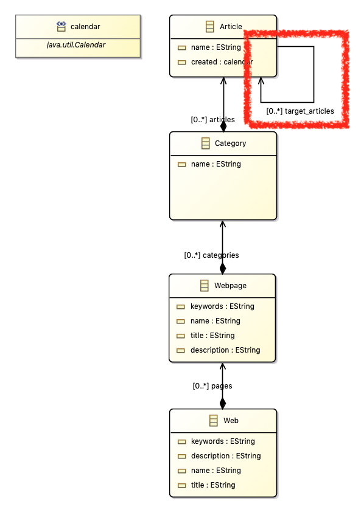

Instantiate the new metamodel and create the metamodel instance below.

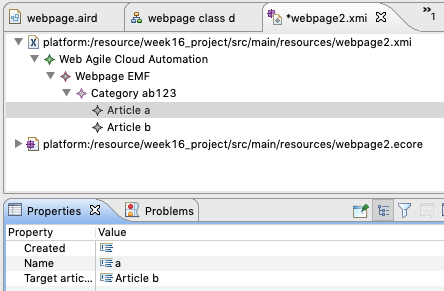

EReferences are not shown as hierarchical containments in the editor, they have to be edited in the properties view.

### Create a domain model and an instance

Create the domain model defined in [this tutorial](https://www.tutorialspoint.com/uml/uml_class_diagram.htm) using class diagram notation as an Ecore metamodel.

Then instantiate it and create the object diagram in [this tutorial](https://www.tutorialspoint.com/uml/uml_object_diagram.htm) as a metamodel instance. 

## Sources

* This tutorial is adapted from [Vogella's tutorial on EMF](https://www.vogella.com/tutorials/EclipseEMF/article.html) 
* User guide of [Ecore tools](https://www.eclipse.org/ecoretools/doc/)

***
&copy; Artur Boronat, 2015-20
