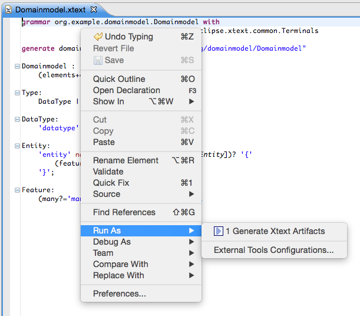
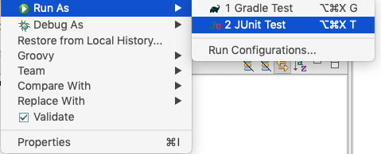
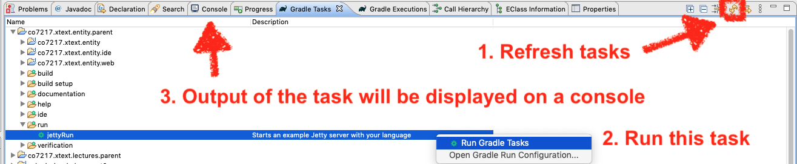

<link rel='stylesheet' href='web/swiss.css'/>

# Generating Editors for a DSL for the Cloud with Xtext

The goal of this tutorial is to use xText to define a grammar for a DSL and to generate an IDE that includes automated facilities for checking the syntactic and semantic consistency of a textual program.

## Open exercises 

### 1. Download the project from Blackboard

* Import it using Gradle
* The grammar file can be found at `co7217.xtext.entity/src/main/java/co7217.xtext.entity/EntityDSL.xtext`


In the following we are going to exercise Kolb's experiential learning cycle for modelling textual concrete syntax. 

### 2. First iteration

#### A. Experiment with concrete examples (Concrete Experience)

In this tutorial we will implement a small domain-specific language to model entities and properties similar to what you may know from Rails, Grails or Spring Roo. The syntax is very suggestive:

```
datatype String
 
entity Blog {
    title: String
    many posts: Post
}
 
entity HasAuthor {
    author: String
}
 
entity Post extends HasAuthor {
    title: String
    content: String
    many comments: Comment
}
 
entity Comment extends HasAuthor {
    content: String
}
```

A few examples are provided as test cases in the file `co7217.xtext.entity/src/test/java/co7217.xtext.entity.tests/CO7217_EntityDSLParsingTest.groovy`


#### B. Reflect and model (Reflective Observation and Abstract Conceptualization)

In this occasion, these stages will be fairly guided so as to illustrate how to use Xtext for the first time.

Let’s now just replace that grammar definition with the one for our entities language:

```
Domainmodel:
    (elements+=Type)*;
 
Type:
    DataType | Entity;
 
DataType:
    'datatype' name=ID;
 
Entity:
    'entity' name=ID ('extends' superType=[Entity])? '{'
        (features+=Feature)*
    '}';
 
Feature:
    (many?='many')? name=ID ':' type=[Type];
```

Let’s have a more detailed look at what the different grammar rules mean:

1. The first rule in a grammar is always used as the start rule. It says that a Domainmodel contains an arbitrary number (*) of Types which are added (+=) to a feature called elements.

```
Domainmodel:
    (elements+=Type)*;
```

2. The rule Type delegates to either the rule DataType or (|) the rule Entity.

```
Type:
    DataType | Entity;
```

3. The rule DataType starts with a keyword 'datatype', followed by an identifier which is parsed by a rule called ID. The rule ID is defined in the super grammar org.eclipse.xtext.common.Terminals and parses a single word, a.k.a identifier. You can navigate to the declaration by using F3 on the rule call. The value returned by the call to ID is assigned (=) to the feature name.

```
DataType:
    'datatype' name=ID;
```

4.  The rule Entity again starts with the definition of a keyword followed by a name.

```
Entity :
    'entity' name=ID ('extends' superType=[Entity])? '{'
        (features+=Feature)*
    '}';
```

Next up there is the extends clause which is parenthesized and optional (?). Since the feature named superType is a cross reference (note the square brackets), the parser rule Entity is not called here, but only a single identifier (the ID-rule) is parsed. The actual Entity to assign to the superType reference is resolved during the linking phase. Finally between curly braces there can be any number of Features, which invokes the next rule.

5. Last but not least, the rule Feature is defined as follows:

```
Feature:
  (modifier=Visibility)? (many ?= 'many')? name = ID ':' type = [Type | QualifiedName]
;

enum Visibility:
    PUBLIC = 'public' 
    | PRIVATE = 'private' 
    | PROTECTED = 'protected';
```

The modifier is optional and is typed with the enumeration type Visibility. As it is optional, by default the public modifier will be used if none is given.

The keyword many shall be used to model a multi-valued feature in this DSL. The assignment operator (?=) implies that the feature many is of type boolean. You are already familiar with the other syntax elements in this parser rule.

This entities grammar already uses the most important concepts of Xtext’s grammar language. You have learned that keywords are written as string literals and a simple assignment uses a plain equal sign (=), whereas a multi-value assignment uses a plus-equals (+=). We have also seen the boolean assignment operator (?=). Furthermore the example contains syntax elements with different cardinalities (? = optional, * = any number, + = at least once) and demonstrates how cross-references can be declared. We have also learnt how to create class and enumeration types. 

Please consult the [Grammar Language Reference](https://www.eclipse.org/Xtext/documentation/301_grammarlanguage.html) for more details. Let’s now have a look what you can do with such a language description.


#### C. Validate your model (Active Experimentation)

Now that we have the grammar in place we need to execute the code generator that will derive the various language components. To do so, right-click into the grammar editor and select `Run As > Generate Xtext Artifacts`. This action generates the parser and text editor and some additional infrastructure code. You will see its logging messages in the Console View.




Run the JUnit test cases (examples given in point 2): only the last two test cases should fail. Select the file with the test suite `CO2717_EntityDSLParsingTest.groovy` and run it with JUnit.



At this point all but the final two test cases should pass.

##### Validating your DSL with your own examples

Additionally you can validate your DSL by running the **web editor** that has been generated for the DSL. Xtext generates a **Jetty server** that runs on port 8080 on localhost. :warning: Make sure you are not running any other server at that port (in case you are doing other modules using web technologies!).

To run the server you need to run the task `run > jettyRun` in the `Gradle Tasks` view, after refreshing the tasks for your projects. Once you have run the task, the output will appear on the `Console` view. In there you will see that the server stays running for you to use the web editor on a browser using the url `http://localhost:8080`. To stop the server you will be asked to hit `Enter`.

This task can also be run from a terminal: cd to the parent project folder and run `./gradlew jettyRun` on Linux/MacOS (`gradlew jettyRun` on Windows).




### 3. Second iteration

Let's go through one more iteration in Kolb's experiential learning cycle:

#### A. Experiment with concrete examples (Concrete Experience)

After you have created your first DSL and had a look at the editor, the language should be refined and incrementally enhanced. The domainmodel language should support the notion of Packages in order to avoid name clashes and to better fit with the target environment Java. A Package may contain Types and other packages. In order to allow for names in references, we will also add a way to declare imports.

In the end we want to be able to split the previously used model into distinct files:

```
// datatypes.dmodel
 
datatype String
// commons.dmodel
 
package my.company.common {
 
    entity HasAuthor {
        author: String
    }
}
// blogs.dmodel
 
package my.company.blog {
 
    import my.company.common.*
 
    entity Blog {
        title: String
        many posts: Post
    }
 
    entity Post extends my.company.common.HasAuthor {
        title: String
        content: String
        many comments: Comment
    }
 
    entity Comment extends HasAuthor {
        content: String
    }
}
```

#### B. Reflect and model (Reflective Observation and Abstract Conceptualization)


Let’s start enhancing the grammar.

1. Since a Domainmodel no longer contains types but also packages, the entry rule has to be modified. Furthermore, a common super type for PackageDeclarations and Types should be introduced: the AbstractElement.

```
Domainmodel:
    (elements+=AbstractElement)*;
 
AbstractElement:
    PackageDeclaration | Type;
```

2. A PackageDeclaration in turn looks pretty much as expected. It contains a number of Imports and AbstractElements. Since Imports should be allowed for the root-Domainmodel, too, we add them as an alternative to the rule AbstractElement.

```
PackageDeclaration:
    'package' name=QualifiedName '{'
        (elements+=AbstractElement)*
    '}';
 
AbstractElement:
    PackageDeclaration | Type | Import;
    
QualifiedName:
    ID ('.' ID)*;
```

The QualifiedName is a little special. It does not contain any assignments. Therefore it serves as a data type rule that returns a String. Hence the feature name of a Package is still of type String.

3. Imports can be defined in a very convenient way with Xtext. If you use the name importedNamespace in a parser rule, the framework will treat the value as an import. It even supports wildcards and handles them as expected. Similar to the rule QualifiedName, QualifiedNameWithWildcard returns a plain string.

```
Import:
    'import' importedNamespace=QualifiedNameWithWildcard;
 
QualifiedNameWithWildcard:
    QualifiedName '.*'?;
```

4. The last step is to allow fully qualified names in cross-references, too. Otherwise one could not refer to an entity without adding an import statement. Please note that the bar `(|)` is not an alternative in the context of a cross-reference, but used to specify the syntax of the parsed string.


#### C. Validate your model (Active Experimentation)

That’s all for the grammar. It should now read as

```
Domainmodel:
  (elements += AbstractElement)*
;
 
PackageDeclaration:
  'package' name = QualifiedName '{'
    (elements += AbstractElement)*
  '}'
;

AbstractElement:
  PackageDeclaration | Type | Import
;
 
Import:
  'import' importedNamespace = QualifiedNameWithWildcard
;
  
QualifiedNameWithWildcard:
  QualifiedName '.*'?
;

QualifiedName:
  ID ('.' ID)*
;

Type:
  DataType | Entity
;
  
DataType:
  'datatype' name=ID 
;
 
Entity:
  'entity' name = ID ('extends' superType = [Entity | QualifiedName])?
  '{'
    (features += Feature)*
  '}'
;

Feature:
  (modifier=Visibility)? (many ?= 'many')? name = ID ':' type = [Type | QualifiedName]
;

enum Visibility:
    PUBLIC = 'public' 
    | PRIVATE = 'private' 
    | PROTECTED = 'protected';
```

You should regenerate the language infrastructure as described in the previous section, and give the editor another try. 

## Individual submission 8% 

Apply Kolb's experiential learning cycle (stages in stages A, B and C above) to add the following feature to the DSL: enumerations that are collections of literals. Such enumeration types can be used as data types for declaring entity attributes.

**Hints:** you need to use 
* one type rule for creating a type `Literal` whose non-terminal `value` is of type `ID`; and 
* one more rule for `DataType` using `|` that starts with the terminal symbol `enumeration` followed by a non-terminal `name` (whose type is an `ID`) and followed by a repetition of occurences of `Literal` (to be stored in the many-valued reference `literals`) in between the terminal symbols `{` and `}`.

The examples below (included as test cases in the test suite) should be parseable.

#### Example 1: Enumeration data types

```
enumeration Colour {
  red
  green
  blue
}
```

#### Example 2: Using enumeration datatypes as types of entity attributes

```
enumeration Status {
  rented
  purchased
  sold
}
entity Car {
  status: Status
}
```

#### 2-Factor Submission

Once all of the test cases pass (they go green), proceed as follows:
* Open a terminal, `cd` to the parent project folder and run `./gradlew test`: this generates a test report that is required by the submission helper.
* Run the file `co7217.xtext.entity/src/main/java/co7217.xtext.entity/submission_solution.groovy`. You only need to edit your username in that file.

This will give you the numeric code that needs to be submitted.

Then generate the zipped file using the script `prepareSubmission`, and upload it to Blackboard.

## Additional resources

* [Xtext overview](http://www.eclipse.org/Xtext/documentation/)
* [xText Grammar reference](http://www.eclipse.org/Xtext/documentation/301_grammarlanguage.html) 
* [Examples in xText](https://www.eclipse.org/Xtext/documentation/201_sevenlang_introduction.html)


***
&copy; Artur Boronat, 2017-20